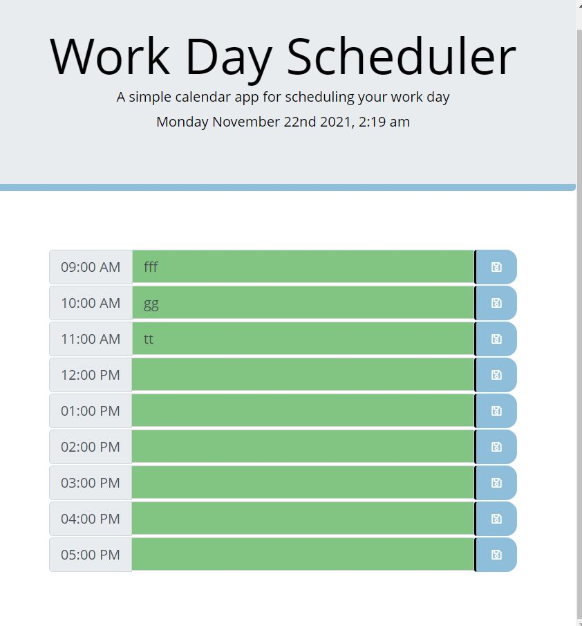

# daily-planner-Application

## Task Description

I will build a daily calendar planner that will help the user to manage his time.
The user will be able to save any future event within any chosen working hour session of the day .
The calendar planner will be styled the way that the user will visually see and make a difference among the current , past and future events .

## Pseudo code description

- When the user open the application , the current date and time is display on top f the page

- 8 timeblocks are displayed at the bottom from 9AM to 5PM

- The time block displaying the current time , the past time and the future time are labeled with a specific color that differentiate them.

- If i click on a timeblock , i can entered a text

- if i enter a text , i can save if using a save button

- if i refresh the page , the text is still displaying

## Git Repository

I created a git repository folder that will host the finish website. The Repository will be found [here](https://github.com/pfansi/daily-planner)

## What have you done

- Created a readme.md file to describe the different building phases of the application.

- broken down the different phase and functionality of the application.

- created an index.html , script.js and style.css file .

- created the main content layout using boostrap library

- imported the Jquery Javascript API library link at the bottom of index.html - It will be used to manipulate the DOM elemnt of the application via event handling.

- imported the Font Awesome icon library to be able to use the vector save favicon omn the save buttons.

- commented index.html page to describe the page layout.

- declared the variable current time using moment.js library methods.

- declared all the variable times that will be display on the timeblock.

- created a function that will check current and class which timeblock in current , in th epast or in the future . The specific colour will then be assign depending on their temporal state.

## Screenshots

- This is the screenshot of the final application. 

## Link to the deploy application

https://pfansi.github.io/daily-planner/

## link to the git hub repository

https://github.com/pfansi/daily-planner
